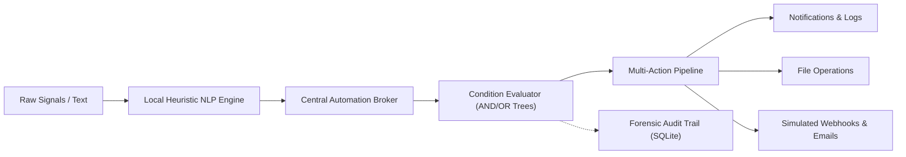
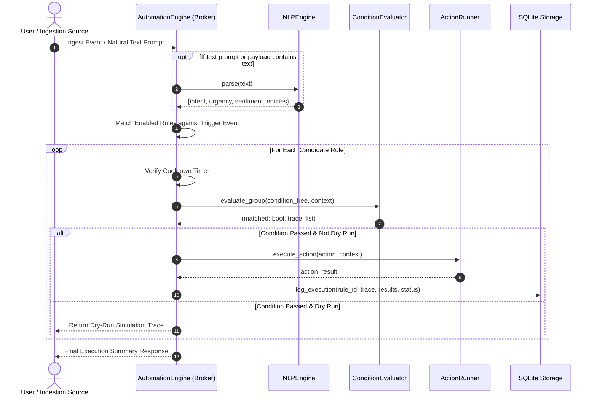

# ⚡ AI Automation Command Center

> **Enterprise-Grade Mission Control Dashboard & Offline AI Automation Engine**  
> *100% Local • Zero Paid APIs • Zero API Keys • Sub-Millisecond Heuristic NLP • Deterministic Rule Execution*

[](https://python.org)
[](https://flask.palletsprojects.com/)
[](LICENSE)
[](test_command_center.py)
[](#-offline-architecture--security-posture)

---

## 🌟 Executive Summary

The **AI Automation Command Center** is an operational control plane designed to ingest system signals, evaluate complex conditional trees, parse natural language incident reports, and trigger automated multi-action mitigation pipelines.

Unlike cloud-dependent automation tools that introduce recurring SaaS fees, external token limits, and outbound security exposure, this command center is powered by an **offline, deterministic rule engine** coupled with a **local heuristic Natural Language Processing (NLP) core**. It delivers instantaneous event triage, real-time hardware telemetry, forensic execution audit trails, and one-click automation blueprints with zero external API dependencies.



---

## 🎯 Portfolio Showcase: AI Automation Engineering Skills

This project was engineered to demonstrate core competencies required in modern AI systems engineering, site reliability engineering (SRE), and intelligent process automation:

### 1. High-Performance Local NLP (Zero-API Architecture)
- Eliminates cloud API dependencies, recurring token bills, and outbound latency bottlenecks.
- Demonstrates deep understanding of tokenization, weighted lexical scoring, continuous urgency mapping, and regex-based entity isolation without relying on black-box external services.
- Delivers deterministic sub-millisecond classification suitable for air-gapped environments, military/defense settings, healthcare compliance (HIPAA), and high-frequency edge IoT nodes.

### 2. Deterministic & Safe Automation Workflows
- Generates transparent, step-by-step condition evaluation traces (`payload.metric >= threshold -> ACTUAL vs TARGET -> PASS/FAIL`).
- Implements defense-in-depth safeguards: cooldown throttles to prevent alert fatigue and infinite loops, sandboxed storage directories, and dry-run simulation capabilities.

### 3. Full-Stack Systems Architecture & Observability
- **Backend**: Clean separation of concerns across rule ingestion (`automation_engine.py`), natural language analysis (`nlp_engine.py`), condition resolution (`evaluator.py`), action dispatching (`actions.py`), and thread-safe persistence (`storage.py`).
- **Telemetry**: Real-time non-blocking system sampling (`psutil`) integrated into an automated background sentinel monitor.
- **Frontend**: Responsive, sci-fi cyberpunk HUD interface featuring glassmorphic cards, live polling loops, dynamic form builders, and visual audit inspectors.

### 4. Hybrid-AI / LLM Pre-Processor Readiness
- Acts as a high-speed, cost-saving edge triage layer. In hybrid deployments, this engine filters 80–90% of routine telemetry events locally before invoking expensive large language models (LLMs) only when deep semantic synthesis is strictly required.

---

## 🚀 Key Features

| Capability | Technical Implementation | Benefit |
|---|---|---|
| **Local Heuristic NLP** | Multi-token weighted dictionaries, sentiment lexicons, urgency heuristic scoring | Sub-millisecond intent extraction with 0 API tokens |
| **Entity Extraction** | IPv4 validator, hostname patterns, RFC HTTP status whitelist, size/percentage regex | Automatic parameter binding from raw operational text |
| **Multi-Condition Engine** | Dot-notation resolver, 10+ comparison operators, nested AND/OR trees | Expressive business logic matching complex telemetry shapes |
| **Multi-Action Pipelines** | Notifications, audit logging, file writing, simulated emails, webhooks, transforms | Autonomous response to operational conditions |
| **Forensic Audit Traces** | Thread-safe SQLite execution logging with step-by-step evaluator paths | 100% transparent auditability with zero black-box decisions |
| **Live HUD Telemetry** | Non-blocking CPU, RAM, Disk, process memory, and thread monitoring | Real-time operational situational awareness |
| **Blueprint Gallery** | Pre-configured production automations for System, Security, DevOps, NLP, Data | Instant 1-click deployment of battle-tested rules |

---

## 🔄 End-to-End Automation Workflow

Every event processed by the Command Center follows an event lifecycle:



### Lifecycle Steps:
1. **Signal Ingestion**: Events enter via REST endpoints (`/api/events/dispatch`), background hardware monitors, or the natural language interface (`/api/nlp/analyze`).
2. **Context Enrichment & NLP Extraction**: The engine populates a unified context object (`event`, `payload`, `system`, and `nlp`). If text is detected, the NLP engine extracts intent, sentiment, continuous urgency, and structured entities.
3. **Trigger Matching**: The broker queries active rules and filters candidates by trigger type (`event`, `natural_text`, or `manual`).
4. **Cooldown Enforcement**: Verifies elapsed seconds against the rule's configured cooldown threshold to prevent flapping.
5. **Condition Tree Resolution**: Evaluates conditions with dot-notation field navigation (`payload.cpu_percent >= 85`). Every step generates a verifiable trace object.
6. **Action Dispatch & Execution**: Sequential execution of actions (`notification`, `file_append`, `webhook_call`, `email_dispatch`).
7. **Audit Trail Persistence**: Execution status, duration in milliseconds, evaluation traces, and output payloads are committed to SQLite.

---

## 🧠 AI NLP Sandbox & Intent Simulator

The **AI NLP Sandbox** allows operators and engineers to test natural language prompts against the automation suite in real time.

```
+--------------------------------------------------------------------------------+
|  OFFLINE NATURAL LANGUAGE SIMULATOR                LOCAL HEURISTIC AI • 0 API  |
+--------------------------------------------------------------------------------+
|  Prompt: "Emergency: database memory utilization surged to 96% on prod-db-01"  |
|                                                                                |
|  [✓] Dry Run Only (Preview rule matching without executing side effects)      |
|                                                                                |
|  [ Analyze & Simulate Automations ]                                            |
+--------------------------------------------------------------------------------+
|  RESULTS & EXTRACTION:                                                         |
|  • Detected Intent : SERVER_ALERT (Confidence: 85%)                            |
|  • Urgency Score   : 95 / 100 [CRITICAL]                                       |
|  • Entities        : hostnames: [prod-db-01] | percentages: [96]               |
|                                                                                |
|  TRIGGERED AUTOMATIONS:                                                        |
|  ▶ Rule: High Memory Sentinel Auto-Mitigation [MATCHED & TRIGGERED]           |
|    • Checked payload.cpu_percent >= 85: actual=96 (PASS)                       |
|    • Simulated Action: Dispatched critical notification & captured log         |
+--------------------------------------------------------------------------------+
```

### Supported NLP Classifications:
- **Intents**: `server_alert`, `security_threat`, `deploy_request`, `backup_request`, `incident_ticket`, `status_inquiry`.
- **Urgency Scoring**: 0 to 100 continuous score calculated from severity lexicons, percentage thresholds (>=90%), and HTTP 5xx codes.
- **Entity Extraction**:
  - **IPv4 Addresses**: Isolated and validated against 4-octet bounds (`0–255`).
  - **HTTP Status Codes**: Whitelisted against RFC specifications (`400`, `401`, `403`, `404`, `500`, `502`, `503`, etc.).
  - **Server Hostnames**: Cloud & internal node names (`prod-db-01`, `srv-worker-02`, `us-east-1a`).
  - **Metrics & Percentages**: Percentages (`94%`), memory sizes (`512MB`, `4.5GB`).
  - **Emails**: Extracted for automated alert routing.

---

## 📜 Forensic Audit Logs & Observability

Every rule execution commits a granular record to the SQLite database:
- **Trace Inspector**: Click "Inspect Trace" on any log row to see exactly which condition passed or failed:
  ```json
  [
    {
      "field": "payload.cpu_percent",
      "operator": ">=",
      "target": 85,
      "actual": 94.5,
      "passed": true,
      "notes": ""
    }
  ]
  ```
- **Execution Latency**: Tracks sub-millisecond execution duration for performance benchmarking.
- **Dispatched Output Inspection**: Stores the full JSON payload produced by all actions.

---

## 📦 Battle-Tested Blueprint Library

The Command Center includes pre-configured automation templates ready for 1-click deployment:

1. **High CPU Resource Sentinel (`System`)**: Monitors CPU utilization and triggers critical alerts when load exceeds 85%.
2. **Security Threat & Intrusion Quarantine (`Security`)**: Detects repeated authentication failures (>=3) or NLP threat intent, dispatches SOC email alerts, and isolates malicious IPs.
3. **Smart NLP Emergency Ticket Router (`NLP`)**: Automatically evaluates freeform incident reports, computes urgency scores >= 60, and routes critical escalations.
4. **API Service Outage Auto-Recovery (`DevOps`)**: Catches HTTP gateway errors (500, 502, 503) and dispatches auto-restart webhooks.
5. **Automated Backup & Archive Verification (`DevOps`)**: Validates database snapshot results, checks archive integrity, and logs verification digests.
6. **Disk Storage Pressure Guard (`System`)**: Warns when disk utilization exceeds 90% and executes log retention scripts.
7. **Data Pipeline Anomaly Filter (`Data`)**: Inspects ETL batch metrics and flags high error/corruption rates (>5%).

---

## 🔒 Offline Architecture & Security Posture

- **100% Air-Gapped Capable**: Operates with zero network calls to external cloud providers.
- **Zero API Keys & Cost Free**: Requires no OpenAI, Anthropic, or cloud API keys. Run continuously without unexpected billing.
- **Sandboxed Local I/O**: File writing and appending actions are strictly sandboxed inside `./automation_storage/` with path traversal protections (`os.path.basename` sanitization).
- **Concurrency & Thread Safety**: All SQLite read/write operations utilize connection pooling and thread-safe locks.

---

## 📁 File Structure

```
AI-Automation-Command-Center/
├── app.py                      # Flask application & RESTful API routes (binds to 0.0.0.0:$PORT)
├── automation_engine.py        # Central event bus, rule broker & background sentinel
├── nlp_engine.py               # Local rule-based & heuristic NLP engine
├── evaluator.py                # Dot-notation field resolver & condition tree evaluator
├── actions.py                  # Multi-action execution dispatchers (notify, file, webhook, email)
├── storage.py                  # Thread-safe SQLite persistence layer
├── telemetry.py                # Hardware & process telemetry monitor (psutil)
├── presets.py                  # Production automation blueprints library
├── requirements.txt            # Production dependencies (Flask, pytest, psutil, gunicorn)
├── render.yaml                 # Render Blueprint configuration for 1-click cloud deployment
├── Procfile                    # Web service process declaration for Render / PaaS
├── .gitignore                  # Git repository exclusion rules
├── README.md                   # System documentation & portfolio guide
├── test_command_center.py      # Unit & integration test suite (27 tests)
├── templates/
│   └── index.html              # Cyberpunk Mission Control HUD UI
└── static/
    ├── css/
    │   └── style.css           # Glassmorphism, animations, responsive HUD layout
    └── js/
        └── app.js              # Real-time dashboard controller & telemetry polling
```

---

## 💻 Quickstart & Demo Guide

### 1. Requirements
- Python 3.10+
- `pip`

### 2. Install Dependencies
```bash
pip install -r requirements.txt
```

### 3. Launch the Command Center
```bash
python app.py
```
Open your browser and navigate to:
```
http://127.0.0.1:5000
```

### 4. Interactive Portfolio Walkthrough:
1. **Explore Mission Control**: Observe live hardware telemetry gauges and active automation counters.
2. **Trigger Quick Event**: Click **"🔥 CPU Spike (94.5%)"** in the Quick Dispatcher. Notice the instant alert, live stream item, and counter update.
3. **Simulate in NLP Sandbox**: Go to the **AI NLP Sandbox** tab, select the preset *"Memory Surge (96%)"*, and click **Analyze & Simulate**. Observe the intent classification, urgency score, extracted entities, and dry-run rule trace.
4. **Inspect Audit Trail**: Go to **Execution Logs**, click **"Inspect Trace"** on any entry, and review the condition evaluation path.
5. **Install a Blueprint**: Open **Blueprints Library** and click **"Install Blueprint"** on any template to add it directly to active rules.

---

## ☁️ Render Cloud Deployment Guide (Free Tier)

This application is fully prepared for zero-cost deployment on [Render](https://render.com).

### Method A: Automated Deployment via `render.yaml` (Blueprint)
1. Push this repository to your GitHub / GitLab account.
2. In the Render Dashboard, click **New +** &rarr; **Blueprint**.
3. Connect your repository. Render will automatically detect [`render.yaml`](file:///C:/Users/It%20Hub/AI-Automation-Command-Center/render.yaml), configure the Python runtime, set up the build command (`pip install -r requirements.txt`), and launch using Gunicorn.
4. Click **Apply** to deploy.

### Method B: Manual Web Service Setup
1. In Render Dashboard, click **New +** &rarr; **Web Service**.
2. Connect your Git repository.
3. Configure the following service settings:
   - **Environment**: `Python 3`
   - **Region**: Any (e.g. Oregon, Frankfurt, Ohio)
   - **Branch**: `main`
   - **Build Command**: `pip install -r requirements.txt`
   - **Start Command**: `gunicorn --bind 0.0.0.0:$PORT app:app`
   - **Plan**: `Free`
4. Add Environment Variables (under the *Environment* tab):
   - `PYTHON_VERSION`: `3.11.9`
   - `SECRET_KEY`: *(Generate a secure random string or leave Render to generate)*
   - `FLASK_DEBUG`: `0`
5. Click **Create Web Service**.

> [!NOTE]
> Render automatically injects the `$PORT` environment variable and routes public HTTPS traffic to it. The application binds to `0.0.0.0:$PORT` dynamically and seeds its initial rules into SQLite on first startup without requiring an external database.

---

## 🧪 Automated Test Verification

The project includes a test suite covering the NLP engine, condition evaluator, action runner, storage persistence, automation engine, and Flask REST APIs.

Run tests with `pytest`:
```bash
pytest test_command_center.py -v
```
Or with standard library `unittest`:
```bash
python test_command_center.py
```

### Test Suite Summary:
```
test_command_center.py::TestNLPEngine::test_backup_and_deploy_intent PASSED
test_command_center.py::TestNLPEngine::test_empty_input PASSED
test_command_center.py::TestNLPEngine::test_invalid_http_status_codes_ignored PASSED
test_command_center.py::TestNLPEngine::test_ipv4_extraction_not_http_status PASSED
test_command_center.py::TestNLPEngine::test_mixed_ipv4_and_http_status PASSED
test_command_center.py::TestNLPEngine::test_security_threat_intent PASSED
test_command_center.py::TestNLPEngine::test_sentiment_analysis PASSED
test_command_center.py::TestNLPEngine::test_server_alert_intent PASSED
test_command_center.py::TestNLPEngine::test_valid_http_status_codes_extraction PASSED
test_command_center.py::TestConditionEvaluator::test_and_or_groups PASSED
test_command_center.py::TestConditionEvaluator::test_dot_notation PASSED
test_command_center.py::TestConditionEvaluator::test_operators PASSED
test_command_center.py::TestActionRunner::test_file_io_action PASSED
test_command_center.py::TestActionRunner::test_notification_and_template_interpolation PASSED
test_command_center.py::TestStorage::test_log_execution_and_retrieval PASSED
test_command_center.py::TestStorage::test_save_and_get_rule PASSED
test_command_center.py::TestStorage::test_seeded_rules PASSED
test_command_center.py::TestStorage::test_toggle_and_delete_rule PASSED
test_command_center.py::TestAutomationEngine::test_ingest_event_matching_rule PASSED
test_command_center.py::TestAutomationEngine::test_ingest_event_not_matching_condition PASSED
test_command_center.py::TestAutomationEngine::test_manual_rule_execution PASSED
test_command_center.py::TestFlaskAPI::test_api_event_dispatch PASSED
test_command_center.py::TestFlaskAPI::test_api_nlp_analyze PASSED
test_command_center.py::TestFlaskAPI::test_api_presets PASSED
test_command_center.py::TestFlaskAPI::test_api_rules_crud PASSED
test_command_center.py::TestFlaskAPI::test_api_status_and_telemetry PASSED
test_command_center.py::TestFlaskAPI::test_index_route PASSED

============================= 27 passed in 10.84s =============================
```

---

## 🔌 REST API Reference

| Method | Endpoint | Description |
|---|---|---|
| `GET` | `/api/status` | Engine status, metrics, and summary stats |
| `POST` | `/api/engine/toggle` | Pause or resume the automation engine |
| `GET` | `/api/telemetry` | Real-time CPU, RAM, and Disk metrics |
| `GET` | `/api/rules` | List all automation rules (filter by category, state) |
| `POST` | `/api/rules` | Create or update an automation rule |
| `POST` | `/api/rules/<id>/toggle` | Enable or disable a rule |
| `POST` | `/api/rules/<id>/run` | Manually trigger a rule |
| `POST` | `/api/events/dispatch` | Ingest and evaluate an event |
| `POST` | `/api/nlp/analyze` | Parse natural language text and simulate matching |
| `GET` | `/api/logs` | Fetch execution audit history (pagination, status filter) |
| `DELETE` | `/api/logs` | Clear execution audit history |
| `GET` | `/api/presets` | Get available blueprint templates |
| `POST` | `/api/presets/install` | Install a blueprint template |
| `GET` | `/api/export` | Download rules as a JSON export |
| `POST` | `/api/import` | Import rules from a JSON payload |

---

## 📄 License

This project is licensed under the MIT License - open for use in personal portfolios, internal tooling, and commercial automation pipelines.
